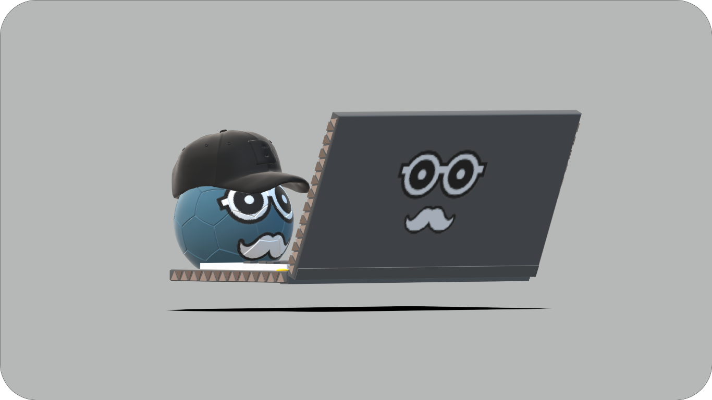

# Welcome



- 👋 Hi, I’m @ltndat _blue_
- 🇻🇳 I'm Vietnamese

## Stack

- [Next.js](https://nextjs.org/) - A React framework with hybrid static & server rendering, and route pre-fetching, etc.
- [Chakra UI](https://chakra-ui.com/) - A simple, modular and accessible component library for React
- [Three.js](https://threejs.org/) - 3D library for JavaScript
- [Framer Motion](https://www.framer.com/motion/) - An animation library for React
- [React Markdown](https://remarkjs.github.io/react-markdown/) - Markdown render for React

## Project structure

```
$PROJECT_ROOT
│   # Static files for images and 3d model file
├── public
│   # Resources for other files.
├── resources
│   # Source code
└── src
    │   # files to use global of app
    ├── globals
    │   # Page files
    ├── pages
    │   # Layout component files
    ├── pages
    │   # React component files
    ├── components
    │   # Non-react modules
    └── lib
```

## License

MIT License.

You can create your own homepage for free without notifying me by forking this project under the following conditions:

- Do not use the 3d blue ball.
- Do not use my simple data public in db branch.
- You can add link to my articles but you must have source from this site.

Check out [LICENSE](./LICENSE) for more detail.

---

░░░░░░⚽░░░░░░ _blue_
